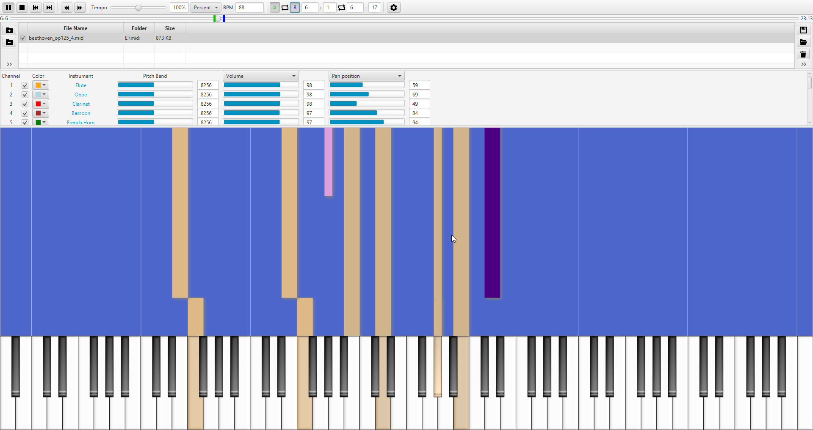

# Musekeys
Midi Music Visualizer/Player inspired by *Synthesia* and *TMIDI*.

* Uses the JavaFX toolkit for UI/rendering
* Playlist support
* Channel Mixer Controls
* Soundfont support (sf2 and dls)
* Tempo Controls and Playback looping
* Right Click on Keyboard or the visualizer for more settings

(This was my attempt at learning JavaFX when I was 14.. and it shows. Presently unmaintained.)

#Download
* A Pre-built release available in the releases section

#Building
* Download repo
* ``gradlew build`` in the root directory. There are no external dependencies.